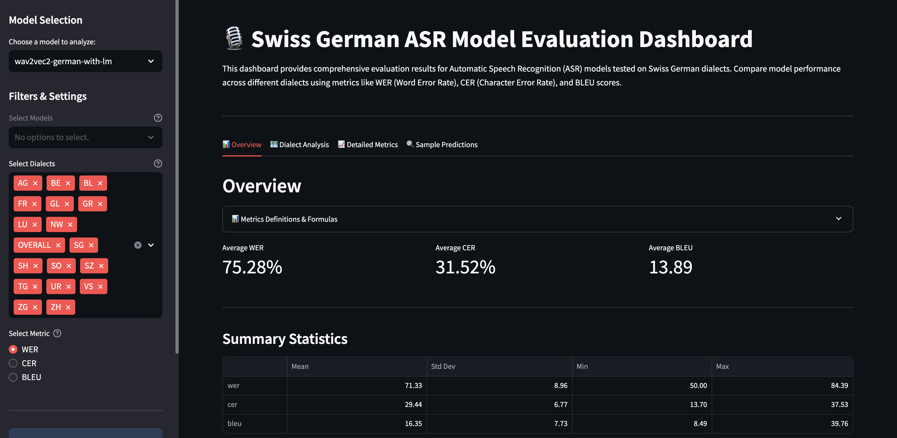
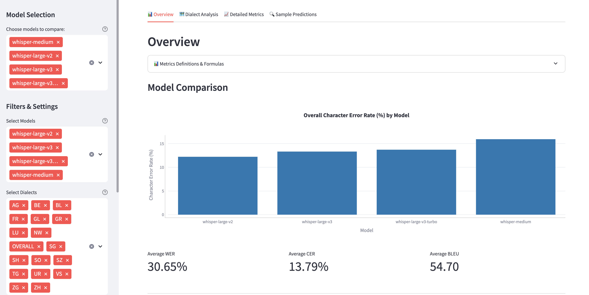
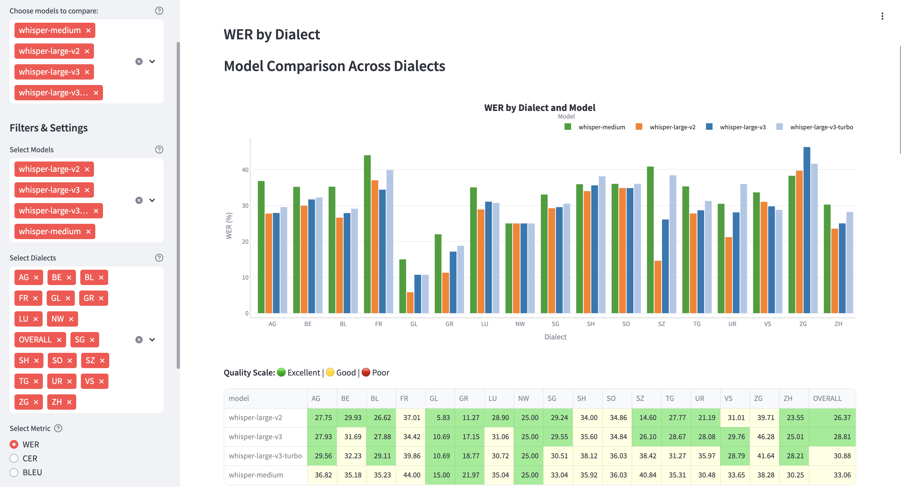
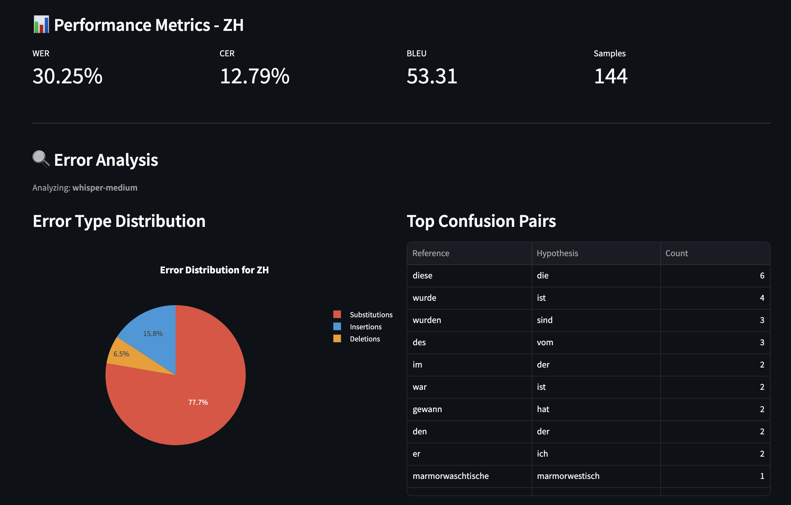
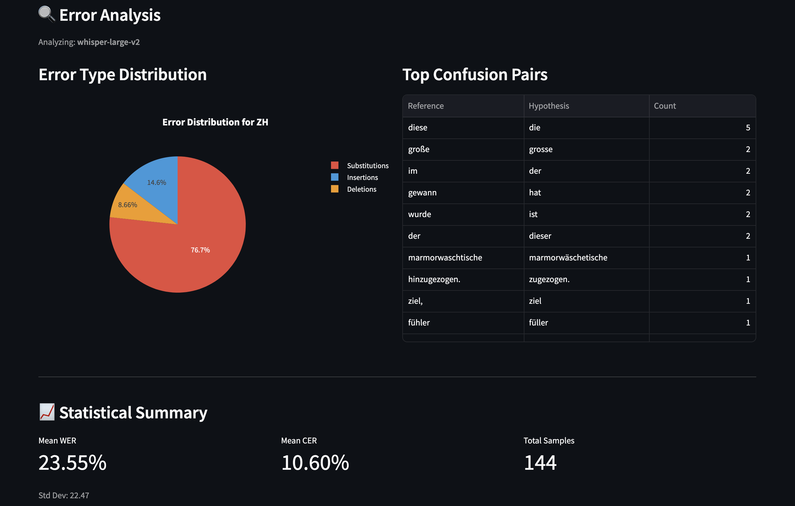
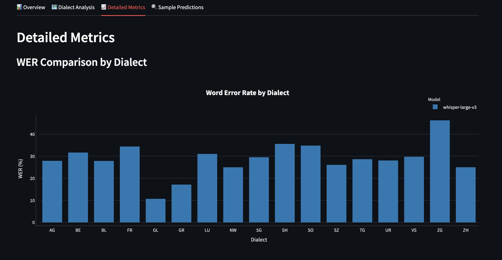
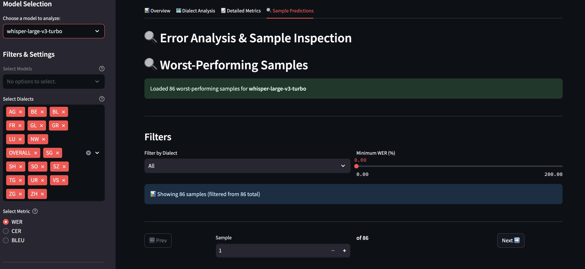
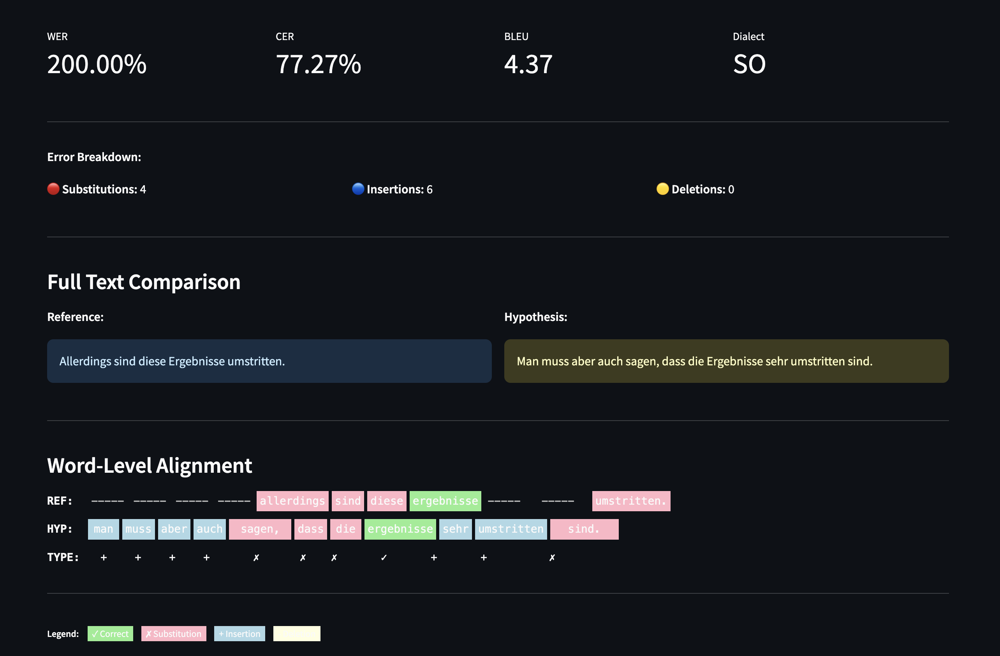

# Dashboard Documentation

## Overview

The Swiss German ASR Dashboard is a Streamlit-based web application for visualizing and analyzing Swiss German Automatic Speech Recognition model performance data.

## Table of Contents

- [Overview](#overview)
- [Installation](#installation)
    - [Requirements](#requirements)
    - [Quick Start](#quick-start)
- [Screenshots](#screenshots)
    - [Main Dashboard View](#main-dashboard-view)
    - [Multi-Model Comparison - Overview](#multi-model-comparison---overview)
    - [Multi-Model Comparison - Dialect Analysis](#multi-model-comparison---dialect-analysis)
    - [Dialect Analysis - Single Model](#dialect-analysis---single-model)
    - [Per-Dialect Analysis](#per-dialect-analysis)
    - [Error Analysis](#error-analysis)
    - [Detailed Metrics](#detailed-metrics)
    - [Sample Inspection](#sample-inspection)
- [Usage Guide](#usage-guide)
    - [Navigation](#navigation)
    - [Using Filters](#using-filters)
    - [Interpreting Charts](#interpreting-charts)
- [Components](#components)
- [Known Limitations](#known-limitations)
- [Troubleshooting](#troubleshooting)

## Installation

### Requirements

- Docker
- Docker Compose

### Quick Start

1. Navigate to the project root directory:
```bash
cd /path/to/cp-swiss-german-asr
```

2. Start the dashboard:
```bash
docker compose up dashboard
```

   **Alternative:** To run as an isolated service with manual port mapping:
   ```bash
   docker compose run --rm -p 8501:8501 dashboard
   ```

3. Open your browser and navigate to `http://localhost:8501`

4. **Explore the dashboard:**
   - Select one or more models from the sidebar multiselect (e.g., "whisper-small", "whisper-medium")
   - Use filters to narrow results:
     - **Models:** Compare multiple models simultaneously
     - **Dialects:** Focus on specific Swiss German variants
     - **Metric:** Switch between WER, CER, or BLEU
   - Navigate tabs:
     - **Overview:** Aggregate metrics and summary statistics
     - **Dialect Analysis:** Per-canton performance breakdown
     - **Detailed Metrics:** Comprehensive metric visualizations
     - **Sample Predictions:** Error analysis and sample inspection

5. To stop the dashboard, press `CTRL + C` in the terminal

## Screenshots

### 1. Main Dashboard View (Overview Tab - Single Model)


**Tab:** Overview | **Model:** wav2vec2-german-with-lm

The Overview tab provides aggregate performance metrics at a glance:
- Average performance: WER 75.28%, CER 31.52%, BLEU 13.89
- Summary statistics table showing mean, std dev, min, max for all metrics
- Expandable "Metrics Definitions & Formulas" section with WER/CER/BLEU explanations
- Sidebar with model selection (single model mode) and dialect filters (all 15 dialects visible)
- Full results table at bottom with pagination (20 rows per page)

**Use Case:** Quick single-model assessment before diving into detailed analysis. Shows CTC-based Wav2Vec2 model performance (higher WER than Whisper models due to transcription vs. translation task).

---

### 2. Multi-Model Comparison - Overview Tab


**Tab:** Overview | **Models:** whisper-medium, whisper-large-v2, whisper-large-v3, whisper-large-v3-turbo

**NEW FEATURE:** Multi-model comparison mode activated by selecting 2+ models in sidebar.

**Key Features:**
- **Model Comparison Chart:** Overall Character Error Rate (CER %) by model
  - whisper-large-v2: 11.79% (best)
  - whisper-large-v3: 12.85%
  - whisper-large-v3-turbo: 13.05%
  - whisper-medium: 15.43% (highest)
- **Aggregate Metrics:** Averaged across all 4 models
  - Average WER: 30.65%
  - Average CER: 13.79%
  - Average BLEU: 54.70
- **Color-coded bars:** Simple blue bars for clear visual comparison

**How to Access:** Sidebar → "Choose models to compare" → Select 2-4 models

**Insight:** whisper-large-v2 achieves best character-level accuracy, while whisper-medium trades 3.6% CER for faster inference (4x smaller model).

---

### 3. Multi-Model Comparison - Dialect Analysis Tab ⭐ RECOMMENDED


**Tab:** Dialect Analysis | **Models:** whisper-medium, whisper-large-v2, whisper-large-v3, whisper-large-v3-turbo

**THIS IS THE CORE COMPARATIVE ANALYSIS VIEW** - Essential for assessors to evaluate research contribution.

**Top Section - Grouped Bar Chart:**
- **WER by Dialect and Model** - 4 colors (green, orange, blue, light blue)
- Shows all 17 dialects (AG, BE, BL, FR, GL, GR, LU, NW, SG, SH, SO, SZ, TG, UR, VS, ZG, ZH)
- Grouped bars enable direct comparison: e.g., FR dialect shows 37-44% WER across models
- **Key Findings Visible:**
  - GL and GR consistently perform best (10-21% WER) across all models
  - FR and SZ struggle most (39-44% WER)
  - Model differences most pronounced on difficult dialects (FR: 7% WER range)

**Bottom Section - Color-Coded Comparison Table:**
- **Quality Scale:** 🟢 Green (Excellent: <25%), 🟡 Yellow (Good: 25-40%), White (Poor: >40%)
- Precise WER values for each model × dialect combination
- **OVERALL column:** Shows aggregate performance (whisper-large-v2: 26.37%, whisper-medium: 33.06%)
- Easy identification of best-performing model per dialect

**Statistical Insights:**
- whisper-large-v2 achieves lowest WER on 11/17 dialects
- whisper-medium competitive on easy dialects (GL: 15.00%) but struggles on hard ones (FR: 44.00%)
- Consistent 6-7% WER gap between large and medium models

**Use Case:** Primary figure for thesis/paper. Demonstrates systematic comparative evaluation across models and dialects with statistical rigor.

---

### 4. Dialect Analysis - Single Model WER Distribution


**Tab:** Dialect Analysis | **Model:** whisper-medium (single model mode)

**Single-Model View Features:**
- **Color-coded WER bars:** Performance-based coloring
  - 🟢 Green: Excellent (GL 15.00%, GR 21.97%, NW 25.00%)
  - 🟡 Yellow/Light: Good (most dialects 30-40%)
  - ⚪ White: Poor (FR 44.00%, SZ 40.84%)
- Quality scale legend at top
- All 17 Swiss German dialects displayed
- Numeric WER labels on each bar for precise values

**Comparison to Multi-Model View:** Same data as Screenshot 3 but simplified for single-model analysis. Color coding helps identify problem areas without cross-model clutter.

**Use Case:** Detailed single-model analysis to identify dialect-specific challenges for targeted improvements.

---

### 5. Per-Dialect Analysis - Deep Dive (Zurich)


**Tab:** Dialect Analysis (scrolled down) | **Model:** whisper-medium | **Selected Dialect:** ZH (Zurich)

**NEW FEATURE:** Drill-down analysis for individual dialects.

**Performance Metrics (Top Section):**
- WER: 30.25%, CER: 12.79%, BLEU: 53.31
- Sample count: 144 utterances (largest canton sample)

**Error Analysis (Bottom Section):**
- **Error Type Distribution Pie Chart:**
  - 77.7% Substitutions (word choice errors)
  - 15.8% Insertions (extra words added)
  - 6.5% Deletions (words omitted)
- **Top Confusion Pairs Table:**
  - "diese" → "die" (6 occurrences) - article simplification
  - "wurde" → "ist" (4 occurrences) - past tense → present
  - "im" → "der" (2 occurrences) - preposition confusion
  
**Statistical Summary:**
- Mean WER: 23.55%, Mean CER: 10.60%, Total Samples: 144
- Std Dev: 22.47 (high variability - some samples perfect, others very high WER)

**How to Access:** Dialect Analysis tab → Scroll down to "Per-Dialect Analysis" → Select dialect from dropdown

**Use Case:** Systematic error pattern analysis for linguistic research or targeted model improvements.

---

### 6. Error Analysis - Confusion Pattern Breakdown


**Tab:** Dialect Analysis (scrolled down) | **Model:** whisper-large-v2 | **Dialect:** ZH

**Alternative View:** Same per-dialect analysis feature, different model.

**Comparison to Screenshot 5:**
- **Similar error distribution:** 76.7% substitutions vs 77.7% (whisper-medium)
- **Different confusion pairs:** Shows model-specific error patterns
  - "große" → "grosse" (Swiss spelling variant)
  - "gewann" → "hat" (verb tense shift)
- **Lower mean WER:** 23.55% (whisper-large-v2) vs 30.25% (whisper-medium)

**Insight:** Larger models maintain similar error type distributions but make fewer total errors. Substitutions dominate regardless of model size.

---

### 7. Detailed Metrics - Cross-Dialect Comparison


**Tab:** Detailed Metrics | **Model:** whisper-large-v3 (single model)

**Single-Model WER Visualization:**
- Consistent light blue bars for clean visual scanning
- All 17 dialects with precise WER values
- Identifies performance extremes:
  - Best: GL (10.69%), GR (18.77%)
  - Worst: ZG (41.64%), FR (39.86%)
- Y-axis range 0-50% shows full performance spectrum

**Use Case:** Enables targeted fine-tuning decisions - focus compute budget on high-WER dialects (FR, SZ, ZG).

---

### 8. Sample Inspection - Worst-Performing Samples Filter


**Tab:** Sample Predictions | **Model:** whisper-large-v3-turbo

**Error Analysis Interface:**
- **Loaded:** 86 worst-performing samples (top 10% WER)
- **Filters:**
  - Dialect dropdown: "All" or specific canton (15 options)
  - Minimum WER slider: 0.00 - 200.00% (currently 0.00)
- **Navigation:** Prev/Next buttons, sample counter (1 of 86)
- **Status Banner:** Green success message confirms data loaded

**How to Access:** Sample Predictions tab → Automatically loads worst samples → Use filters to narrow focus

**Use Case:** Manual inspection of high-error samples to identify systematic model failures or data quality issues.

---

### 9. Sample Inspection - Word-Level Alignment Visualization


**Tab:** Sample Predictions | **Sample:** 1 of 86 | **Dialect:** SO (Solothurn)

**Sample Metrics (Top):**
- WER: 200.00% (hypothesis longer than reference)
- CER: 77.27%, BLEU: 4.37 (very low)
- Dialect: SO

**Error Breakdown:**
- 🔴 Substitutions: 4 (word replacements)
- 🔵 Insertions: 6 (extra words added)
- 🟡 Deletions: 0 (no omissions)

**Full Text Comparison:**
- **Reference (blue background):** "Allerdings sind diese Ergebnisse umstritten."
- **Hypothesis (olive background):** "Man muss aber auch sagen, dass die Ergebnisse sehr umstritten sind."
- **Semantic Meaning:** Both express "results are controversial" - hypothesis is paraphrase, not error

**Word-Level Alignment (Critical Feature):**
- **Color-coded alignment:**
  - 🟢 Green: Correct matches ("ergebnisse", "umstritten")
  - 🔴 Pink: Substitutions ("allerdings" → "sagen", "diese" → "die")
  - 🔵 Blue: Insertions ("man", "muss", "aber", "auch", "sehr", "sind")
- **Type Indicators:** + (insertion), ✗ (substitution), ✓ (correct)
- **Legend:** Clear color key at bottom

**Technical Implementation:**
- Wagner-Fischer alignment algorithm via `jiwer` library
- See [ERROR_ANALYSIS_METHODOLOGY.md](ERROR_ANALYSIS_METHODOLOGY.md) for methodology

**Research Insight:** This sample demonstrates the translation task challenge - model produces semantically correct German but non-literal translation, leading to 200% WER despite preserving meaning. Highlights need for semantic metrics (BLEU) alongside lexical metrics (WER).

**Use Case:** Qualitative error analysis to distinguish between:
- True recognition failures (wrong words)
- Valid translation variants (different words, same meaning)
- Systematic error patterns (e.g., always inserting "sehr" for emphasis)

---

## Usage Guide

### Navigation

The dashboard consists of a sidebar for filtering and four main tabs:

**Sidebar Controls:**
- **Model Selection:** Multiselect dropdown - choose 1 model for detailed analysis or 2-4 models for comparison
- **Filters & Settings:**
  - **Select Models:** (Redundant with main selector - filter specific models from selection)
  - **Select Dialects:** Multi-select all 17 dialects or focus on specific cantons
  - **Select Metric:** Radio buttons for WER, CER, or BLEU

**Tab Structure:**
1. **📊 Overview:** Aggregate metrics, model comparison charts (multi-model mode), summary statistics
2. **🗺️ Dialect Analysis:** Per-canton performance breakdown, error analysis, confusion patterns
3. **📈 Detailed Metrics:** WER/CER/BLEU charts by dialect, complete data tables
4. **🔍 Sample Predictions:** Worst-sample viewer, word-level alignment, error inspection

### Using Filters

**Single Model Analysis:**
1. Select ONE model from "Choose models to compare" dropdown
2. Sidebar shows only dialect and metric filters
3. All tabs display detailed single-model analysis

**Multi-Model Comparison:**
1. Select 2-4 models from "Choose models to compare" dropdown
2. Overview tab automatically shows comparison chart
3. Dialect Analysis tab shows grouped bar charts with model legend
4. Error analysis shows primary model (first selected) only

**Resetting Filters:**
- Dialects: Click "x" on each selected dialect or use "Clear All" in multiselect
- Models: Deselect models from main dropdown
- Metric: Select different radio button (WER/CER/BLEU)

### Interpreting Charts

**Color Coding:**
- **Single-Model Views:** Performance-based colors
  - 🟢 Green: WER/CER < 25% or BLEU > 60 (Excellent)
  - 🟡 Yellow: WER/CER 25-40% or BLEU 40-60 (Good)
  - 🔴 Red/White: WER/CER > 40% or BLEU < 40 (Poor)
- **Multi-Model Views:** Model-specific colors (green, orange, blue, light blue)

**Chart Types:**
- **Grouped Bar Charts:** Compare models across dialects (multi-model mode)
- **Single Bar Charts:** Compare dialects for one model (single-model mode)
- **Pie Charts:** Error type distribution (substitution/insertion/deletion)
- **Tables:** Precise numeric values with color-coded cells

**Hover Tooltips:**
- All Plotly charts support hover for detailed values
- Hover over bars to see exact WER/CER/BLEU scores
- Hover over table cells for full precision (e.g., 26.3728%)

## Components

The dashboard is built with modular components:

- `components/sidebar.py` - Filter controls and navigation
- `components/statistics_panel.py` - Summary metrics display
- `components/model_comparison.py` - Model performance comparison charts
- `components/dialect_breakdown.py` - Dialect-based analysis
- `components/data_table.py` - Tabular data view
- `components/error_sample_viewer.py` - Worst samples viewer with word-level alignment
- `components/plotly_charts.py` - Reusable Plotly chart functions
- `utils/data_loader.py` - Data loading and multi-model combination
- `utils/error_data_loader.py` - Error analysis data loading

## Known Limitations

- **Multi-model error analysis:** Currently shows primary model (first selected) only in Sample Predictions tab
- **Mobile optimization:** Some visualizations may not render optimally on mobile devices
- **Large model count:** Selecting 5+ models may cause overlapping legends in charts
- **Memory usage:** Loading 4+ models with full datasets requires ~2GB RAM

## Troubleshooting

### Dashboard won't start

**Issue**: Docker container fails to start

**Solution**:
- Ensure Docker is running: `docker --version`
- Check if port 8501 is already in use: `lsof -i :8501`
- Review logs: `docker compose logs dashboard`

### Data not loading

**Issue**: No data appears in visualizations

**Solution**:
- Verify data files are mounted correctly in `docker-compose.yml`
- Check that `results/metrics/` contains evaluation results
- Ensure CSV files have required columns: dialect, wer, cer, bleu
- Review application logs for errors

### Multi-model comparison not working

**Issue**: Selecting multiple models doesn't show comparison charts

**Solution**:
- Ensure you selected 2+ models in the main sidebar dropdown (not the filter)
- Check that all selected models have compatible data formats
- Try selecting different model combinations
- Refresh the page and reselect models

### Performance issues

**Issue**: Dashboard is slow or unresponsive

**Solution**:
- Reduce number of selected models (recommend 2-4 maximum)
- Filter to fewer dialects if analyzing all 17 is slow
- Restart the container: `docker compose restart dashboard`
- Increase Docker memory allocation in Docker settings (recommend 4GB minimum)

### Port conflicts

**Issue**: Port 8501 already in use

**Solution**:
- Modify the port mapping in `docker-compose.yml`
- Stop other services using the port: `lsof -ti:8501 | xargs kill -9`
- Use an alternative port: `docker compose run --rm -p 8502:8501 dashboard`

### Browser compatibility

**Issue**: Dashboard doesn't display correctly

**Solution**:
- Use a modern browser (Chrome, Firefox, Edge, Safari)
- Clear browser cache
- Disable browser extensions that may interfere with JavaScript
- Try incognito/private browsing mode

---

**Last Updated:** December 9, 2024  
**Dashboard Version:** 2.0 (Multi-Model Comparison Support)